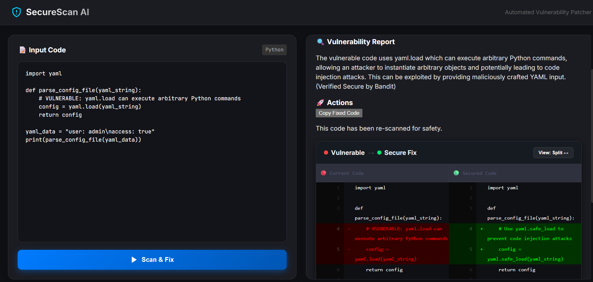

# 🛡️ SecureScan AI: Agentic Vulnerability Patcher

An automated, AI-driven security pipeline that detects vulnerabilities in Python code using static analysis and autonomously generates verified secure patches.



## 🚀 Overview
**SecureScan AI** bridges the gap between detection and remediation. Traditional scanners (like Bandit) flag issues but don't fix them. This tool uses a **Verification Loop** architecture: it identifies a flaw, prompts Llama 3.3 to write a fix, and then re-scans the fix to ensure it's actually secure.

## ✨ Key Features
* **Agentic Remediation:** Uses Llama 3.3 (via Groq) to refactor insecure code while maintaining original logic.
* **The Verification Loop:** Every AI patch is passed back through `Bandit`. If the patch still triggers security flags, the system alerts the user—preventing AI "hallucinations" of secure code.
* **Clean Diff UI:** A professional side-by-side comparison of vulnerable vs. secure code using a custom React diff viewer.
* **Education-First:** Provides a "Why was this dangerous?" card for every fix, explaining the underlying CWE (Common Weakness Enumeration).

## 🛠️ Tech Stack
* **Frontend:** React, Tailwind CSS, Lucide Icons, React-Diff-Viewer
* **Backend:** FastAPI (Python), Uvicorn
* **AI Engine:** Llama 3.3 (70B)
* **Security Analysis:** Bandit (Static Analysis Security Testing - SAST)
* **Database:** Supabase (PostgreSQL)

## 🧠 The Pipeline
1. **Detection:** Backend runs `bandit` on the user's code.
2. **Refactoring:** The code + bandit report are sent to the AI Agent.
3. **Verification:** The AI's output is re-scanned by Bandit.
4. **Final Delivery:** The user sees a verified, safe patch with a full risk explanation.

## 🧪 Included Demo (`vulnerable_test.py`)
The project includes a consolidated test suite that demonstrates the engine's ability to handle:
* **Arbitrary Code Execution:** Refactoring `eval()` into safe mathematical parsing.
* **SQL Injection:** Converting string-formatted queries into parameterized statements.
* **Command Injection:** Migrating `os.system` calls to secure `subprocess` executions.

## 💻 Setup & Installation

### 1. Backend
```bash
cd backend
python -m venv venv
source venv/bin/activate  # Windows: venv\Scripts\activate
pip install -r requirements.txt