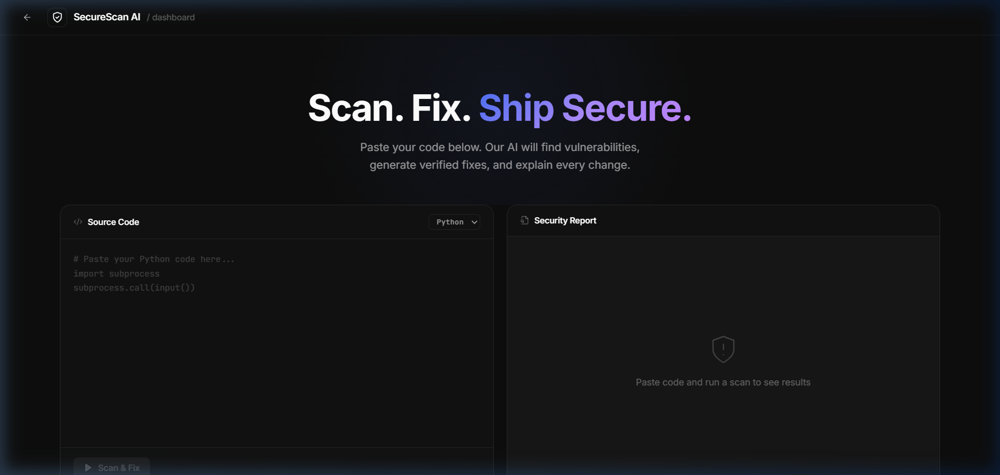

<div align="center">

# 🛡️ SecureScan AI

**AI-Powered Vulnerability Scanner & Auto-Patcher**

*Detect security flaws, generate verified fixes, and ship secure code — in seconds.*

[](https://python.org)
[](https://fastapi.tiangolo.com)
[](https://react.dev)
[](https://groq.com)
[](LICENSE)

<br/>


</div>

---

## 🎯 What Is This?

**SecureScan AI** is a full-stack security tool that goes beyond detection. Traditional scanners flag issues but leave you to fix them manually. SecureScan uses a **Verification Loop** architecture:

1. **Detect** — Static analysis finds vulnerabilities in your code
2. **Fix** — Llama 3.3 70B generates a production-safe patch
3. **Verify** — The fix is re-scanned to ensure it's actually secure
4. **Explain** — Every change comes with a "Why was this dangerous?" breakdown

If the AI's fix still triggers security flags, you get a **Manual Review Required** warning — no silent failures.

---

## 🖥️ Dashboard



> Paste your code, select a language, and hit **Scan & Fix**. Results appear in real-time with diff highlighting and risk analysis.

---

## ✨ Features

| Feature | Description |
|---------|-------------|
| 🤖 **AI-Powered Fixes** | Llama 3.3 70B generates battle-tested, production-safe patches automatically |
| 🔁 **Verification Loop** | Every AI fix is re-scanned by SAST tools — verified badge or manual review warning |
| 🌐 **Multi-Language** | Python (Bandit) and Java (OWASP regex patterns), with more coming |
| 🎯 **Diff Highlighting** | Line-level red/green diff viewer showing exactly what changed and why |
| 📋 **One-Click Copy** | Copy the fixed code directly to your clipboard |
| 💡 **Education-First** | "Why was this dangerous?" explanation for every vulnerability (CWE references) |
| ⚡ **Real-Time** | Background processing with live status updates |

---

## 🏗️ Architecture

```
┌──────────────────────────────────────────────────────────────┐
│                        FRONTEND                              │
│   React 18 + Vite + Framer Motion + Lucide Icons             │
│   Landing Page ─── Dashboard ─── DiffResult Viewer           │
└──────────────┬───────────────────────────────────────────────┘
               │ REST API (axios)
               ▼
┌──────────────────────────────────────────────────────────────┐
│                        BACKEND                               │
│   FastAPI + Uvicorn + SQLAlchemy (SQLite)                    │
│                                                              │
│   ┌─────────────┐    ┌──────────────┐    ┌───────────────┐  │
│   │  API Routes  │───▶│ Scan Service │───▶│  LLM Engine   │  │
│   │  /scan POST  │    │  (Strategy)  │    │ (Groq/Llama)  │  │
│   │  /scan GET   │    └──────┬───────┘    └───────────────┘  │
│   └─────────────┘           │                                │
│                    ┌────────┴────────┐                       │
│                    │    Scanners     │                       │
│                    │ ┌─────────────┐ │                       │
│                    │ │   Python    │ │  ← Bandit SAST        │
│                    │ │   (bandit)  │ │                       │
│                    │ ├─────────────┤ │                       │
│                    │ │    Java     │ │  ← OWASP Regex        │
│                    │ │   (regex)   │ │                       │
│                    │ └─────────────┘ │                       │
│                    └─────────────────┘                       │
└──────────────────────────────────────────────────────────────┘
```

---

## 🛠️ Tech Stack

| Layer | Technology |
|-------|-----------|
| **Frontend** | React 18, Vite, Framer Motion, Lucide React, Vanilla CSS |
| **Backend** | Python 3.10+, FastAPI, Uvicorn, SQLAlchemy |
| **AI Engine** | Llama 3.3 70B via [Groq](https://groq.com) |
| **SAST** | Bandit (Python), OWASP Regex (Java) |
| **Database** | SQLite (local, zero-config) |
| **Testing** | Pytest (backend), Vitest (frontend) |

---

## 🚀 Quick Start

### Prerequisites

- **Python 3.10+** with `pip`
- **Node.js 18+** with `npm`
- **Groq API Key** — [Get one free here](https://console.groq.com)

### 1. Clone & Setup Backend

```bash
git clone https://github.com/Shubham-711/Smart-security-scanner.git
cd Smart-security-scanner/backend

# Create virtual environment
python -m venv venv
venv\Scripts\activate        # Windows
# source venv/bin/activate   # macOS/Linux

# Install dependencies
pip install -r requirements.txt
```

### 2. Configure Environment

Create a `.env` file in the `backend/` directory:

```env
GROQ_API_KEY=your_groq_api_key_here
```

### 3. Start Backend

```bash
cd backend
uvicorn app.main:app --reload
```

> Backend runs at `http://127.0.0.1:8000` — Swagger docs at `/docs`

### 4. Start Frontend

```bash
cd frontend
npm install
npm run dev
```

> Frontend runs at `http://localhost:5173`

---

## 🧪 Running Tests

### Backend Tests
```bash
cd backend
python -m pytest tests/ -v
```

### Frontend Tests
```bash
cd frontend
npm test
```

---

## 📂 Project Structure

```
Smart-security-scanner/
├── backend/
│   ├── app/
│   │   ├── api/
│   │   │   └── routes.py           # FastAPI endpoints
│   │   ├── core/
│   │   │   └── config.py           # Environment config
│   │   ├── db/
│   │   │   ├── database.py         # SQLAlchemy setup
│   │   │   └── models.py           # DB models
│   │   ├── models/
│   │   │   └── schemas.py          # Pydantic schemas
│   │   ├── services/
│   │   │   ├── llm_engine.py       # Groq/Llama integration
│   │   │   ├── scan_service.py     # Orchestration logic
│   │   │   └── scanners/
│   │   │       ├── base_scanner.py # Strategy pattern base
│   │   │       ├── python_scanner.py
│   │   │       └── java_scanner.py
│   │   └── main.py                 # FastAPI app entry
│   ├── tests/
│   └── requirements.txt
├── frontend/
│   ├── src/
│   │   ├── Dashboard.jsx           # Main scanner UI
│   │   ├── LandingPage.jsx         # Landing page
│   │   ├── DiffResult.jsx          # Diff viewer component
│   │   ├── services/api.js         # API client
│   │   ├── App.css                 # Dashboard styles
│   │   ├── LandingPage.css         # Landing styles
│   │   ├── index.css               # Global tokens
│   │   └── main.jsx                # React entry
│   ├── package.json
│   └── vite.config.js
└── README.md
```

---

## 🔒 Supported Vulnerabilities

| Category | Examples |
|----------|---------|
| **Hardcoded Secrets** | Passwords, API keys, tokens in source code |
| **Command Injection** | `os.system()`, `subprocess.call(input())` |
| **SQL Injection** | String-formatted queries, unsanitized user input |
| **Arbitrary Code Exec** | `eval()`, `exec()`, `pickle.loads()` |
| **Weak Cryptography** | MD5/SHA1 for passwords, insecure random |
| **Path Traversal** | Unsanitized file path construction |

---

## 🤝 Contributing

1. Fork the repository
2. Create your feature branch (`git checkout -b feature/amazing-feature`)
3. Commit your changes (`git commit -m 'Add amazing feature'`)
4. Push to the branch (`git push origin feature/amazing-feature`)
5. Open a Pull Request

---

## 📄 License

This project is licensed under the MIT License — see the [LICENSE](LICENSE) file for details.

---

